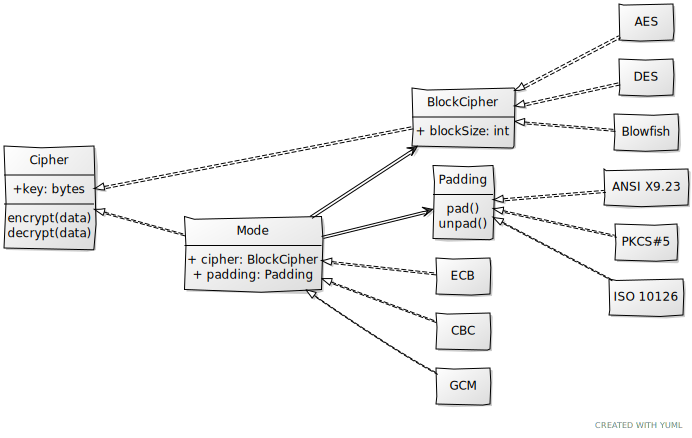

# Symmetric

To understand how to use classes from this module consider the class diagram bellow:



1. [Cipher](./Cipher.py) - abstract class. Main interface that defines how symmetric cipher works on the topmost level.

2. [BlockCipher](./BlockCipher.py) - more specific type of symmetric cipher, encrypts only blocks of data with particular `blockSize`. This is still abstract class.

3. [AES](./AES.py) - concrete implementation of the `BlockCipher`. There might be a lot of different block ciphers implemented, like `DES`, `Blowfish` and others. This is the class you can instantiate and use for encryption/decryption.

4. [Mode](./Modes/Mode.py) - mode of operation interface. This class implements a decorator pattern. It is instantiated with a `BlockCipher` and modifies `encrypt()/decrypt()` functions behavior so that they can work with data of sizes not equal to the `cipher`'s block size. It also might take `Padding` class to `pad`/`unpad` data before/after encryption/decryption so the data size may not even be restricted to be multiple of `cipher`'s block size. However, usage of padding and checks of data to have appropriate size must be considered in concrete implementations.

5. [Padding](./Paddings/Padding.py) - padding interface. Can be used to pad data before encryption for it to have appropriate length, or revert the padding with `unpad` function.

6. [ECB](./Modes/ECB.py) - concrete implementation of an encryption mode.

7. __PKCS#5__ - concrete implementation of a padding.


So, if you want to encrypt data with `AES-CBC` with `PKCS#5` padding, you will write code similar to the following:

```Python
from ptCrypt.Symmetric.Paddings.PKCS5 import PKCS5
from ptCrypt.Symmetric.Modes.CBC import CBC
from ptCrypt.Symmetric.AES import AES


data = b"qwerty"
key = b"12345678"

cipher = CBC(AES(key), padding = PKCS5())

encrypted = cipher.encrypt(data)
```